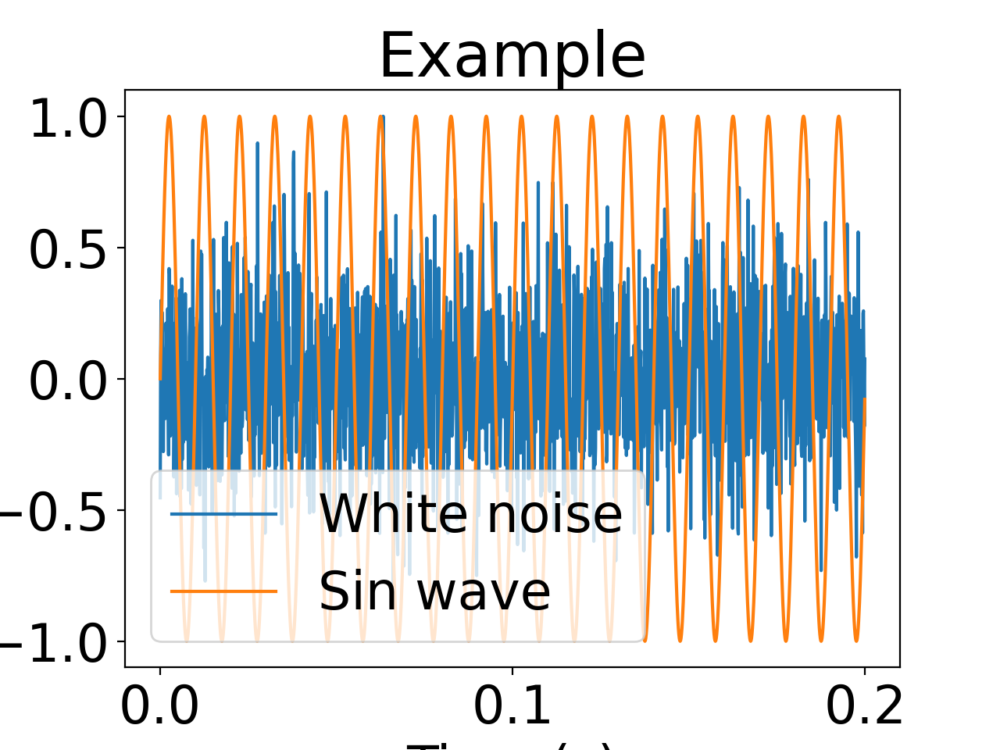

# 科学技術論文に用いる図表のための matplotlib 設定

## TL; DR

### 理想

1. 図を載せる媒体の **大きさを調べる**
2. その媒体に適した大きさの図を **設計** する

### 現実

- 何も考えずに **デフォルト設定のまま** プロット
- フォントサイズや線の太さなどを **場当たり的に** 設定
  - 膨れ上がるオプション… `plt.plot(x, y, markersize=16, fontsize=24, linewidth=2, xlabel="Time", ...)`
- 完成した図を **拡大・縮小** して載せるせいでバランスが崩壊
- 論文と発表スライドで **同じ図を流用** するために本文のフォントサイズとのバランスが崩壊

## 背景

論文執筆，研究発表において実験を視覚的に伝えるために図は非常に有用です．
しかし，図の大きさやフォントサイズのバランスが崩れているために伝わりづらくなっている残念な例を非常によく見かけます．
その原因は **大きさを意識していない** からであると一言で言えます．
大きさとは論文・スライドに載せる図の大きさと，それを載せる対象である媒体の大きさの両方が含まれます．
以下では matplotlib を用いて作成した図の大きさをどのように決めるべきか説明します．

### サンプルデータの作成

まずはサンプルデータを作成しましょう．
正弦波と白色雑音をプロットするだけの図です．

```sample1.py
import matplotlib.pyplot as plt
import numpy as np

np.random.seed(100)
fs = 8000
sec = 0.3
freq = 100
t = np.arange(fs * sec) / fs
s = np.sin(2 * np.pi * freq * t)
x = np.random.randn(int(fs * sec))
x /= np.max(x)

fig = plt.figure()
plt.plot(t, x, label="White noise")
plt.plot(t, s, label="Sin wave")

plt.title("Example")
plt.xlabel("Time (s)")
plt.ylabel("Amplitude")
plt.legend()
plt.savefig("sample.pdf")
```

このコードを実行すると次のようなグラフが生成されます．


`pdfinfo` コマンドを使うと寸法やメタデータを確認できます

```bash
pdfinfo sample.pdf
```

私の環境では次のような結果が得られました．

```txt
Creator:         Matplotlib v3.10.3, https://matplotlib.org
Producer:        Matplotlib pdf backend v3.10.3
CreationDate:    Mon Jul 20 12:00:00 2025 JST
Custom Metadata: no
Metadata Stream: no
Tagged:          no
UserProperties:  no
Suspects:        no
Form:            none
JavaScript:      no
Pages:           1
Encrypted:       no
Page size:       460.8 x 345.6 pts
Page rot:        0
File size:       31014 bytes
Optimized:       no
PDF version:     1.4
```

この図の大きさは横 460.8 pt 縦 345.6 pt であることがわかりました．
これは matplotlib のデフォルトである 6.4 inch x 4.8 inch だからです．
inch を pt に変換するためには 72 をかければよいため $6.4 \times 72 = 460.8$ となり一致することがわかります．

### よく見る残念な例

ここでは研究のプレゼンテーション資料を Microsoft Powerpoint （以下，ﾊﾟﾜﾎﾟ）で作成することを想定し，実際の研究発表でもよく見かける残念な例を紹介します．
まずは matplotlib のデフォルトをそのまま使うとどうなるかを確認しましょう．
次の図は前述の図をそのままﾊﾟﾜﾎﾟの 16:9 スライドのデフォルトサイズのスライドに載せた場合です．

図中のグラフの赤い枠線は matplotlib が出力する図全体の大きさをみやすくするためにつけています．
ちなみにファイルをドラッグアンドドロップしただけでそれ移行のサイズ調整はしていません．
図全体の大きさはちょうどよいですが，図中のフォントサイズがとても小さいことがわかります．
それもそのはず，matplotlib のデフォルトのフォントサイズは 10 pt だからです．
論文であればフォントサイズが 10 pt 前後なのでこのくらいでもいいですが，プレゼンテーション資料には向きません．
しかし論文に使った図をプレゼンテーション資料に流用したなどの理由で，このような本文と図のバランスが悪いスライドはかなり多く見られます．

ではこの資料を見た共著者から「字が小さいから作り直してくれ！」というコメントを受けたとしましょう．
matplotlib では全体のフォントサイズは matplotlibrc の `font.size` というパラメータで調整できます．
先ほどのコードの冒頭に次の行を追加し全体のフォントサイズを大きくしてみました．

```py
plt.rcParams["font.size"] = 24
```

作り直した図は次の通りです．

軸ラベルがはみ出てしまっていますね．
これではいけません．
図全体のサイズをもっと大きくしてみましょうか．
冒頭に次の行を追記します．

```py
plt.rcParams["font.size"] = 24
plt.rcParams["figure.figsize"] = (12, 8)
```

すると次のような図になります．

この図をﾊﾟﾜﾎﾟにそのまま挿入するとどうなるでしょうか．

最初の例よりもずいぶん大きくなっていますね．
図を全体的に大きくしているので当然です．
そして多くの人はこの図を拡大縮小してスライドの大きさに合わせます．

**これが多くの人が苦しんでいる原因です．**
せっかくフォントサイズを大きくしたのに図を全体的に縮小してしまったせいで枠線やプロットの線の太さなどのバランスが崩れてしまいました．
最初のページと見比べてみると，結局あまり変わっていないことがわかります．
これのおかしさに気づいていない人は，ここからさらに線の太さを調整したり軸ラベルのフォントサイズを調整したり，場当たり的な修正を繰り返すことになります．
図を出力する側と，出力した図を配置する側の両方でいじろうとするからいろんな不幸が生まれるのです．

ではﾊﾟﾜﾎﾟで拡大縮小することをやめて， matplotlib 側で描画領域の大きさを固定してみましょう．
matplotlib の `tight_layout()` はという便利な関数があります．
`savefig` を呼び出す前に次の行を追記しましょう．

```py
plt.tight_layout()
```

こんな図が出力されます．

ﾊﾟﾜﾎﾟに載せてみましょう．

まだ余白が大き過ぎますね．
プロットの領域が小さくなり，凡例もかぶっていて見づらいです．
これは matplotlib 内で `tight_layout()` を呼び出した時の余白の設定があるからです．
`pad`というオプション引数で少し調整しましょう．

ずいぶんましになりました．
ここまでの調整をすべてまとめたコードは次の通りです．

```sample_mod.py
import matplotlib.pyplot as plt
import numpy as np

plt.rcParams["font.size"] = 24
# plt.rcParams["figure.figsize"] = (12, 8)


np.random.seed(100)
fs = 8000
sec = 0.2
freq = 100
t = np.arange(fs * sec) / fs
s = np.sin(2 * np.pi * freq * t)
x = np.random.randn(int(fs * sec))
x /= np.max(np.abs(x))

fig = plt.figure()
plt.plot(t, x, label="White noise")
plt.plot(t, s, label="Sin wave")

plt.title("Example")
plt.xlabel("Time (s)")
plt.ylabel("Amplitude")
plt.legend()
plt.tight_layout(pad=0.2)

plt.savefig("sample.pdf")
```

今度は論文に載せる図の場合の例を作ってみましょう．
例えば，論文によく用いられている A4 用紙は横 210mm 縦 297mm で A4 2 段組み論文のほとんどが左右に 15mm 程度の余白があるため，実際に有効な幅は 90mm 程度になります．
[ICASSP 2024 Paper kit](https://cmsworkshops.com/ICASSP2024/papers/paper_kit.php) をダウンロードして `Template.tex` を改変してみました．
次の図は 1 個目の図と同じく matplotlib のデフォルトを何も変えずに載せた場合の結果です．


```Template.tex
\begin{figure}[htb]
  \centering
  \includegraphics{example1.pdf}
  \caption{Example of placing a figure with experimental results.}
\end{figure}
```

これを考えると matplotlib のデフォルトである 縦 121.92 mm，横 162.56 mm は A4 2 段組の論文には大きすぎることがわかります．
デフォルトを信じてはいけません [^1] ．
次の図は 1 個目の図と同じく図のサイズを縦 86 mm，横 54 mm に調整してみました．

ﾊﾟﾜﾎﾟと同様に論文の場合でも `\includegraphics[width=\linewidth]{example1.pdf}` のような LaTeX 側でのサイズ調整は非常によく見かけますが避けるべきです．

## 方法

### バランスのとれた図の作り方

以下では研究のための図を作成するために役立つ一般的な方法を共有します．
その方法は **図の大きさを意識する** だけです．
とても簡単なことですが，簡単すぎて多くの人が見過ごしています．

ここではﾊﾟﾜﾎﾟに載せる図を例に，ﾊﾟﾜﾎﾟで図を拡大縮小することなく何も調整しない状態で狙った大きさになるような図の作り方を説明します．
まずは図を載せる媒体の大きさを調べます．
これがわからなくては，図をどれくらいのバランスで描くべきか見当がつかないからです．
ﾊﾟﾜﾎﾟであれば，スライド全体の大きさは「デザイン」タブの「スライドのサイズ」で確認できます．

次に載せたい図を大きさを決めます．

この例では幅をスライド 6 割くらい，アスペクト比を黄金比になるようにしてみました．
ﾊﾟﾜﾎﾟであれば適当に四角形を描いてみて，「図の書式設定」で大きさを確認できます．
この大きさをメモしておきましょう．
ついでに，ﾊﾟﾜﾎﾟのスライド内のフォントサイズも調べておきましょう．
このスライドでは本文のフォントサイズは 28 pt でした．
適切に設定すれば次のようになります．

図の拡大縮小はもはや必要ありません．

### matplotlib 内のサイズ調整

matplotlib 内では図の大きさは inch ，フォントサイズは pt で指定されていることに注意する必要があります．
主要な単位の変換は次の通りです．

- $1 \text{inch} = 25.4 \text{mm}$
- $1 \text{inch} = 72 \text{pt}$
  なお， px 単位への変換は DPI に依存するため， 詳しくは [公式ドキュメント](https://matplotlib.org/stable/gallery/subplots_axes_and_figures/figure_size_units.html#sphx-glr-gallery-subplots-axes-and-figures-figure-size-units-py) をご覧ください．

例えば先ほどの図のように縦 86 mm，横 54 mm にするためには冒頭に次のような設定を書けばよいです．

```py
mm = 1 / 25.4
plt.rcParams["figure.figsize"] = (86 * mm, 54 * mm)
```

### matplotlibrc の設定

毎回 `plt.rcParams` に色んな設定を追加して調整するのはなかなか大変です．
また論文やプレゼン資料でフォントや図の大きさを変えることは当然想定されます．
自分好みを設定を保存してそれを使い回すにはどうすればいいでしょうか？
これらの設定は [matplotlibrc](https://matplotlib.org/stable/users/explain/customizing.html) にまとめられています．
matplotlibrc の設定を Python コード内で書き換えるには，上記のように python コード内で `plt.rcParams` を書き換えることで対応できます．

```sample.py
import matplotlib.pyplot as plt
import numpy as np

plt.rcParams['lines.linewidth'] = 2
plt.rcParams['lines.linestyle'] = '--'
data = np.random.randn(50)
plt.plot(data)
```

また， `matplotlibrc` 設定ファイルを作成することでも対応できます．
上記コードと同じディレクトリに `matplotlibrc` というファイルを作り

```matplotlibrc
lines.linewidth: 1.5
lines.linestyle: --
```

というテキストファイルを作成して保存します．
そして次のコードを実行すれば同じような結果が得られます．

```sample.py
import matplotlib.pyplot as plt
import numpy as np

data = np.random.randn(50)
plt.plot(data)
```

自分で好きな設定ファイルを作成し，適当なディレクトリに配置して python コード内から呼び出すこともできます [^2]．
matplotlib 内でデフォルトので設計されている様々な[スタイル](https://matplotlib.org/stable/gallery/style_sheets/style_sheets_reference.html) は，内部的に異なる matplotlibrc ファイルを作成しそれを読み込むことで実現されています．
詳しくは [公式ドキュメント](https://matplotlib.org/stable/users/explain/customizing.html) を参照してください．

ここまでの説明はﾊﾟﾜﾎﾟでのプレゼンテーションに限らず，論文・書籍・ポスター発表・口頭発表などあらゆる媒体で使える方法論です．
図をソフト側で拡大縮小していじるのではなく，元の図を書くソフトの方を調整することを心がけましょう．

## まとめ

- 出力結果を拡大・縮小しない
- 論文とプレゼン資料で図の流用しない
- 媒体の大きさに合わせて図の大きさを調整する

## 参考文献

### matplotlib

- [Eitan Lees (@eitanlees) on Speaker Deck](https://speakerdeck.com/eitanlees)
  - 非常に洗練されたスライドで matplotlib を使った可視化についてまとめている人
- [Ten simple rules for better figure](https://journals.plos.org/ploscompbiol/article?id=10.1371/journal.pcbi.1003833)
  - タイトル邦訳：より良い図を作る 10 の簡単なルール
  - 上のリンク内で紹介されている論文
- [rougier/scientific-visualization-book: An open access book on scientific visualization using python and matplotlib](https://github.com/rougier/scientific-visualization-book)
  - Matplotlib を使った可視化についてまとめた 200 ページ超の大作本
  - 図をさらっと眺めるだけでも参考になる
- [【Python】matplotlib を使うならとりあえず読むべき記事 - Qiita](https://qiita.com/takuma-1234/items/2249b434506e6f0ca27f)
  - matplotlib 関係のまとめ記事

### プレゼンテーション

- [伝わるデザイン](http://tsutawarudesign.com)
- [高道慎之介先生：研究発表のためのプレゼンテーション技術](https://www.slideshare.net/ShinnosukeTakamichi/ss-48987441)
- [プレゼンスライドがみるみる良くなる基本の推敲技術 -事例付き解説-](https://note.com/hisashi_is/n/n188b42f83dda)
- [情報関連講習会　 PowerPoint デザイン | 明治大学](https://www.meiji.ac.jp/wsys/edu-info/ppt2.html)
- [Use The CommKit : Broad Institute of MIT and Harvard](https://mitcommlab.mit.edu/broad/use-the-commkit/)

[^1]: https://speakerdeck.com/eitanlees/visualization?slide=75
[^2]: https://matplotlib.org/stable/users/explain/customizing.html#defining-your-own-style
